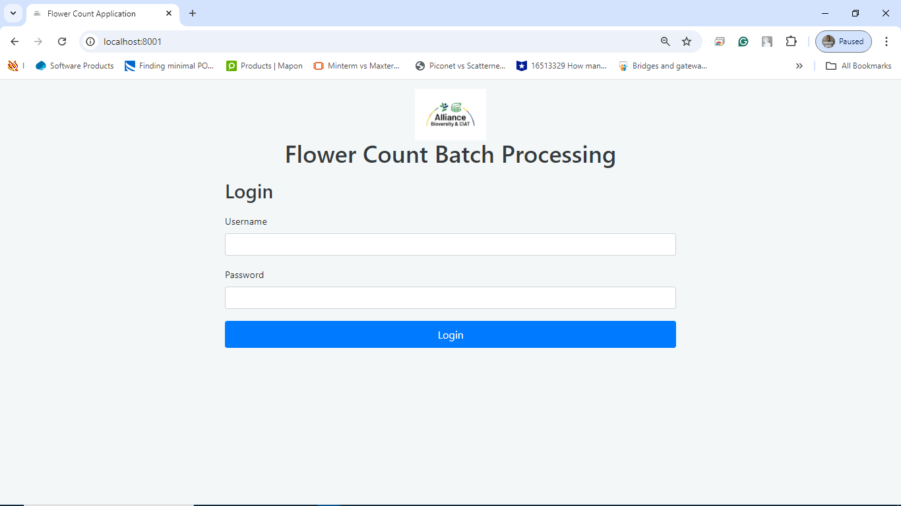

# Flower Count Project

This project includes a backend API, a frontend web application, and a mobile application for flower counting. Follow the instructions below to set up and run each component.

## Table of Contents

- [Backend](#backend)
- [Frontend](#frontend)
- [Mobile Application](#mobile-application)
- [Design Decisions and Challenges](#design-decisions-and-challenges)

## Backend

The backend is built using FastAPI and provides an API for processing images.

### Prerequisites

- Python 3.8+
- Pip

### Setup

1. **Clone the Repository:**

    ```bash
    git clone https://github.com/Justinekemhe/Flower-Count-Project-App.git
    cd Flower-Count-Project-App/Image-Applicaton Backend and Front End
    ```


2. **Run the API:**

    ```bash
    uvicorn main:app --host 127.0.0.1 --port 8000 --reload
    ```

    The API will be available at `http://127.0.0.1:8000`.


   

4. **Test the API:**

    You can test the endpoints using tools like Postman or directly via the Swagger UI at `http://127.0.0.1:8000/docs`.

## Frontend

The frontend is a web application built using HTML, CSS, and JavaScript.

### Prerequisites

- A modern web browser

### Setup

1. **Clone the Repository:**

    ```bash
    git clone https://github.com/Justinekemhe/Flower-Count-Project-App.git
    cd Flower-Count-Project-App/frontend
    ```

2. **Run the Frontend:**

   Run python -m http.server 8001
   Open the `index.html` file in a web browser. Ensure that the backend API is running before testing the frontend.
Login information

   
   


## Mobile Application

The mobile application is built using Flutter.

### Prerequisites

- Flutter SDK
- Dart

### Setup

1. **Clone the Repository:**

    ```bash
    git clone https://github.com/Justinekemhe/Flower-Count-Project-App.git
    cd Flower-Count-Project-App/mobile
    ```

2. **Install Dependencies:**

    ```bash
    flutter pub get
    ```

3. **Run the Application:**

    Ensure you have an emulator running or a physical device connected, then use:

    ```bash
    flutter run
    ```

    The app will be available on your emulator or connected device.
   


## Design Decisions and Challenges

### Design Decisions

- **Backend:** Used FastAPI for its high performance and ease of use in creating RESTful APIs. Integrated Hugging Face Transformers for image processing.
- **Frontend:** Utilized Bootstrap for responsive design and clean UI. Designed for user-friendly interaction with the backend API.
- **Mobile Application:** Built with Flutter for cross-platform support, allowing the app to run on both Android and iOS with a single codebase.

### Challenges Faced

- **Backend Integration:** Handling image file uploads and processing asynchronously was complex. Resolved by using FastAPI's built-in support for asynchronous operations.
- **Frontend and Mobile Sync:** Ensuring consistent communication between the frontend and backend involved dealing with CORS issues and testing API responses.
- **Mobile Development:** Implementing camera functionality and image processing required integrating several Flutter packages and handling device-specific issues.
